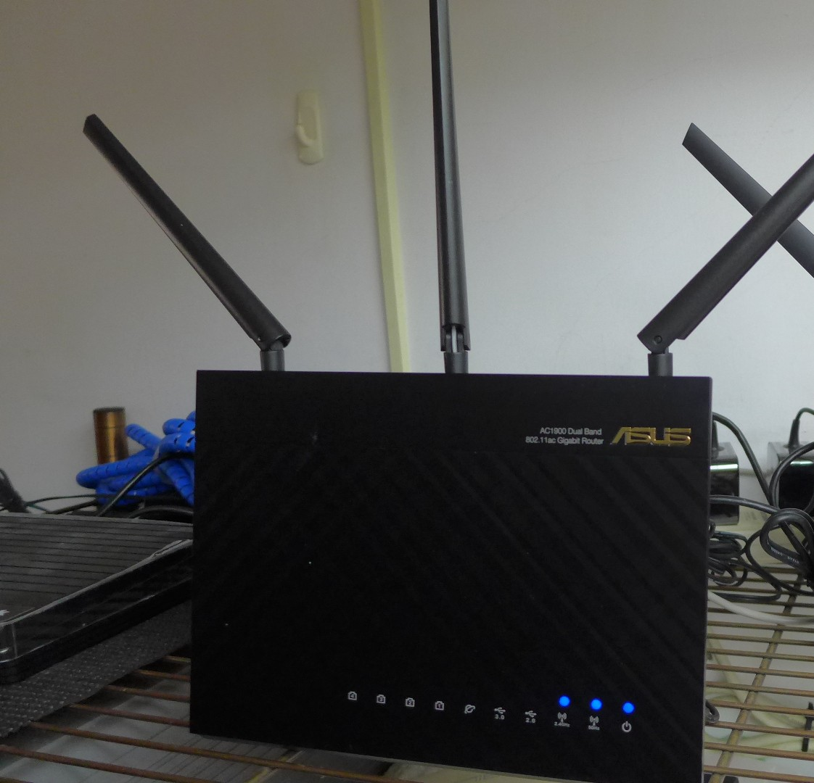
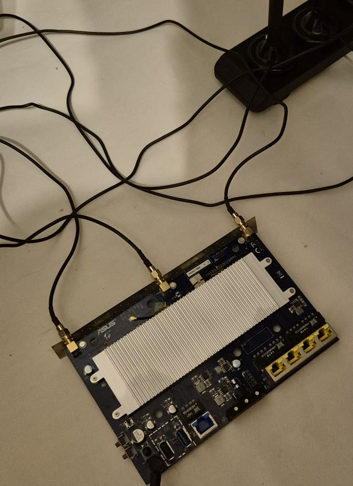
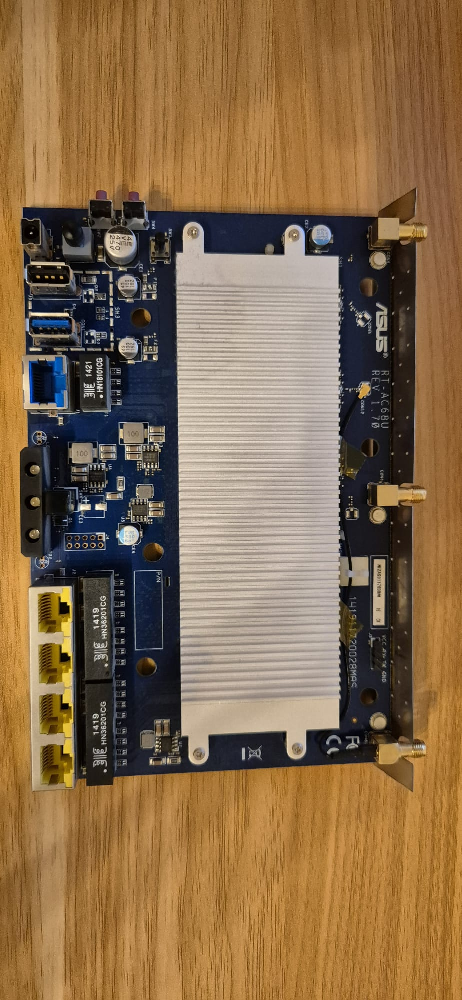
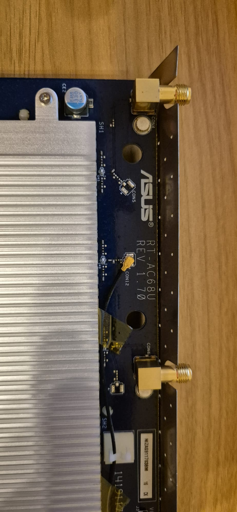
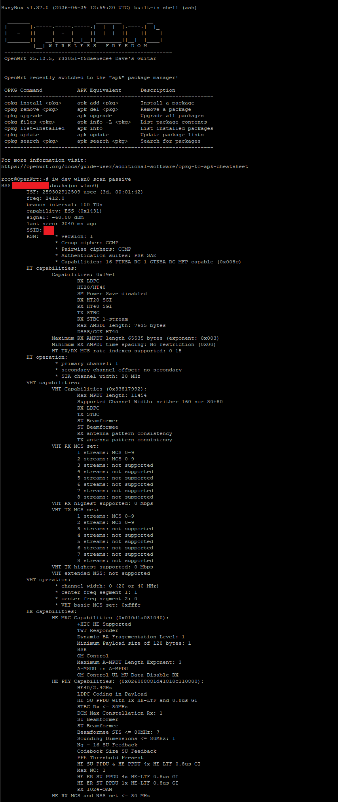

# BCM4360 receive support for b43 / OpenWrt

<p align="center">
  <a href="https://github.com/massimomazzariol/b43-bcm4360/releases/tag/v0.1.0">
    
  </a>
  
  
  
  <a href="LICENSE">
    
  </a>
</p>

Experimental, receive-only **Broadcom BCM4360** support for the Linux
**b43** wireless driver on OpenWrt, developed and validated on a physical
**ASUS RT-AC68U**.

On the tested router the BCM4360 2.4 GHz radio comes up under b43,
registers with mac80211/cfg80211 and performs passive 2.4 GHz scans.
BSS advertisements are received on the correct channels with signal
strength information, while standard Linux `iw` tooling decodes their
wireless information elements.

The supported path is intentionally **receive-only**. Transmission,
association and 5 GHz operation remain disabled.



<p align="center">
  <em>ASUS RT-AC68U - the hardware platform used for development and validation.</em>
</p>

> [!IMPORTANT]
> The hardware-specific radio and board data required to operate the
> BCM4360 are **not distributed with this repository**.
> See [Hardware data requirement](#hardware-data-requirement).

---

## Current status

| | |
|---|---|
| **Tested hardware** | ASUS RT-AC68U - BCM4360 D11 core rev 42, AC-PHY rev 1, BCM2069 rev 4, 2.4 GHz device |
| **Tested software** | OpenWrt 25.12.5 · Linux 6.12.94 · mac80211 backports 6.18.26 · b43 microcode 784.2 |
| **Working** | module probe and attach · 2.4 GHz receive path · mac80211/cfg80211 integration · passive scanning · BSS reception · channel and signal reporting |
| **Intentionally disabled** | transmission · active scanning · association · connectivity · AP/mesh/ad-hoc · 5 GHz · 40/80 MHz |
| **Supported board** | ASUS RT-AC68U |
| **Release** | [v0.1.0](https://github.com/massimomazzariol/b43-bcm4360/releases/tag/v0.1.0) |

---

## Hardware under test

The driver was developed and validated against a physical ASUS RT-AC68U
rather than an emulated wireless device.



<p align="center">
  <em>RT-AC68U development board during hardware testing.</em>
</p>

<table>
<tr>
<td width="50%" align="center">



<strong>RT-AC68U main board</strong>

</td>
<td width="50%" align="center">



<strong>Hardware revision marking</strong>

</td>
</tr>
</table>

---

## Overview

Upstream b43 contains only a stub for AC-PHY devices and marks AC-PHY
support as broken.

This project adds the pieces required for a deliberately constrained
BCM4360 receive path:

- **BCM2069 rev 4 radio support**
  - power-up;
  - reference and analog configuration;
  - VCO calibration;
  - 2.4 GHz channel tuning;

- **AC-PHY rev 1 receive path**
  - carrier-search control;
  - RX LPF configuration;
  - receive gain configuration;
  - clip and energy-detection settings;
  - per-channel RX resampling;

- **BCM4360 D11 rev 42 receive DMA**
  - receive descriptor ring;
  - RX buffer posting;
  - RX interrupt handling;

- **mac80211 / cfg80211 integration**
  - managed and monitor interface modes;
  - 2.4 GHz channels exposed as `NO_IR`;
  - transmit path disabled;

- **RT-AC68U hardware gate**
  - board profile validation;
  - AC-PHY / BCM2069 identity checks;
  - only the tested 2.4 GHz BCM4360 is accepted;

- **external hardware-data loader**
  - hardware-specific radio and board data are loaded separately through
    the kernel firmware API;
  - no hardware-data payload is stored in this repository.

---

## Architecture

```text
                         Linux userspace
                              │
                              │  iw / nl80211
                              ▼
                    mac80211 / cfg80211
                              │
                    passive scan / RX
                              │
                              ▼
                         b43 core
                managed + monitor interfaces
                     TX path disabled
                              │
               ┌──────────────┼──────────────┐
               │              │              │
               ▼              ▼              ▼
          RX DMA         AC-PHY rev 1    Board gate
        D11 rev 42       receive path    RT-AC68U only
               │              │
               │              ▼
               │        BCM2069 rev 4
               │           radio
               │              │
               └───────┬──────┘
                       ▼
                    BCM4360
                  2.4 GHz RX
                       │
                       ▼
               real 802.11 frames

              ┌─────────────────────┐
              │ Hardware-data loader│
              │  request_firmware() │
              └──────────┬──────────┘
                         │
                local data packages
                not distributed here


         TX                5 GHz
      DISABLED           DISABLED
```

---

## What works

On the tested ASUS RT-AC68U:

- `b43` detects the **BCM4360**, D11 core revision 42;
- the driver detects **AC-PHY revision 1**;
- the driver detects **BCM2069 radio revision 4**;
- the 2.4 GHz device attaches successfully;
- the router's second BCM4360, corresponding to the 5 GHz radio, is
  rejected;
- one wiphy is registered;
- `managed` and `monitor` interface modes are available;
- channels 1-14 are exposed;
- every exposed channel is marked `NO_IR`;
- no 5 GHz channels are exposed;
- standard Linux wireless tooling can perform passive scans;
- real BSS advertisements are received;
- `iw` reports:
  - SSID;
  - signal level;
  - frequency;
  - RSN/WPA security information;
  - HT capabilities and operation;
  - VHT capabilities and operation;
  - HE capabilities;
- BSS entries inspected during validation matched their advertised
  primary channels;
- observed transmit counters remained unchanged at zero during the
  validated passive-scan run.

---

## Running on OpenWrt

A standard Linux wireless command is enough to exercise the receive path:

```sh
iw dev wlan0 scan passive
```

Example from the validated hardware:

<p align="center">

</p>

<p align="center">
  <em>
    OpenWrt running a standard <code>iw dev wlan0 scan passive</code>
    against the BCM4360 receive path. Network identifiers are redacted.
  </em>
</p>

The screenshot above is not output from a project-specific demo program:
it is the regular Linux `iw` userspace tool receiving data through
mac80211 and b43.

Detailed sanitized validation results are available in
[docs/VALIDATION.md](docs/VALIDATION.md).

---

## What does not work

This is intentionally **not a complete BCM4360 driver**.

The current implementation does not provide:

- transmission;
- active scanning;
- association;
- network connectivity;
- access-point mode;
- mesh mode;
- ad-hoc mode;
- 5 GHz operation;
- 40 MHz or 80 MHz channels;
- support for other BCM4360 boards;
- support for other AC-PHY chips such as BCM4352;
- support for other BCM2069 revisions.

Receive sensitivity and throughput have not been characterised.

> [!CAUTION]
> This is experimental driver-development work and is not intended for
> production systems.

---

## Development background

The project started from the existing Linux b43 AC-PHY stub and the lack
of usable BCM4360 support in the upstream driver.

Development involved studying and cross-referencing:

- Linux b43 and its existing PHY/radio implementations;
- OpenWrt's mac80211 and b43 packaging;
- the bcm-specs documentation used by b43 development;
- existing AC-PHY-related upstream code and documentation;
- Alessio Ferri's earlier experimental
  [`b43-ac-wip`](https://github.com/AlessioFerri/b43-ac-wip) work as a
  technical reference.

No code from `b43-ac-wip` is included in this repository.

The implementation was developed incrementally around a conservative
first milestone: **receive a real 802.11 environment without enabling
transmission**.

That produced the following progression:

1. identify the BCM4360 / AC-PHY / BCM2069 combination;
2. bring up the BCM2069 rev 4 radio;
3. implement the AC-PHY rev 1 receive path;
4. implement BCM4360 D11 rev 42 RX DMA;
5. integrate the device with mac80211/cfg80211;
6. restrict the public path to the tested RT-AC68U profile;
7. expose 2.4 GHz channels as `NO_IR`;
8. keep TX and 5 GHz disabled;
9. separate hardware-specific data from driver code;
10. validate the exact public release candidate on real hardware.

The objective of the public v0.1.0 release is therefore deliberately
narrow: provide a reproducible and inspectable **receive-only BCM4360
bring-up**, rather than claiming complete device support.

---

## Building

The patches target:

- **OpenWrt 25.12.5**
- `bcm53xx` target
- ASUS RT-AC68U
- Linux 6.12.94
- mac80211 backports 6.18.26

Clone OpenWrt:

```sh
git clone https://git.openwrt.org/openwrt/openwrt.git
cd openwrt
git checkout v25.12.5
```

Apply this repository:

```sh
/path/to/b43-bcm4360/tools/apply-to-openwrt.sh .
```

Configure OpenWrt using `make menuconfig`, or add the required options to
`.config`.

Relevant configuration:

```text
CONFIG_TARGET_bcm53xx=y
CONFIG_TARGET_bcm53xx_generic=y
CONFIG_TARGET_bcm53xx_generic_DEVICE_asus_rt-ac68u=y
CONFIG_PACKAGE_kmod-b43=y
CONFIG_B43_FW_6_30=y
CONFIG_B43_FW_SQUASH_COREREVS="5,6,7,8,9,10,11,13,15,16,28,29,30,42"
CONFIG_B43_FW_SQUASH_PHYTYPES="G,N,LP,HT,AC"
CONFIG_PACKAGE_B43_PHY_AC=y
```

Then build:

```sh
make -j"$(nproc)"
```

For full build instructions see
[docs/REPRODUCING.md](docs/REPRODUCING.md).

---

## Hardware data requirement

The receive path requires chip/radio and board-specific hardware data,
including:

- channel tuning rows;
- RF-sequencer data;
- receive gain tables;
- board front-end control values;
- related receive-path configuration.

**This data is not distributed with this repository.**

The driver expects two packages in the firmware search path:

```text
/lib/firmware/b43/bcm4360-ac1-2069r4.bin
/lib/firmware/b43/bcm4360-board-asus-rt-ac68u.bin
```

The package format and validation rules are documented in
[docs/HARDWARE-DATA.md](docs/HARDWARE-DATA.md).

Without the required packages, the BCM4360 device is not initialised.

Cloning this repository alone therefore does **not** provide a working
radio.

---

## Data-loader tests

The external hardware-data loader can be tested independently on a Linux
PC:

```sh
tests/data-loader/run.sh
```

Current public release result:

```text
31/31 passed
```

The tests cover, among other cases:

- CRC validation;
- ABI version checking;
- chip/radio identity;
- board identity;
- section bounds;
- overlapping sections;
- missing mandatory data;
- malformed records;
- optional data handling;
- invalid receive-gain values.

Synthetic test data is used. No hardware-data payloads are included.

---

## Hardware validation

The exact v0.1.0 release-candidate implementation was tested on physical
hardware using the file-based hardware-data loader.

### Test environment

| Component | Validated configuration |
|---|---|
| Board | ASUS RT-AC68U |
| Chip | BCM4360 rev 3 |
| D11 core | rev 42 |
| PHY | AC-PHY rev 1, analog rev 12 |
| Radio | BCM2069 rev 4 |
| OpenWrt | 25.12.5 |
| Kernel | Linux 6.12.94 |
| mac80211 | backports 6.18.26 |
| b43 microcode | 784.2 |

### Result

| Check | Result |
|---|---|
| BCM4360 probe | PASS |
| AC-PHY rev 1 detection | PASS |
| BCM2069 rev 4 detection | PASS |
| 2.4 GHz channels | 14 |
| NO_IR channels | 14 / 14 |
| 5 GHz channels | 0 |
| Direct passive scans | 5 / 5 |
| Validation-helper scans | 5 / 5 |
| BSS/channel matches | 50 / 50 |
| Channel mismatches | 0 |
| `tx_packets` before / after | 0 / 0 |
| microcode TX counter before / after | `0x0000` / `0x0000` |
| Associated stations | 0 |
| Final validation result | **PASS** |

See [docs/VALIDATION.md](docs/VALIDATION.md) for the full sanitized
validation record.

---

## Known bring-up messages

The validated configuration may emit:

- a `b43_rate_memory_init()` warning because existing b43 does not provide
  the corresponding AC-PHY rate-table initialisation;
- BCM2069 rev 4 calibration-completion notices on the three radio cores;
- error `-95` when the second, 5 GHz BCM4360 is deliberately rejected.

These messages did not prevent passive receive operation during the
validated run.

---

## Repository structure

```text
.
├── patches/
│   ├── mac80211/
│   │   └── brcm/
│   │       ├── 820-b43-enforce-bounds-check-on-firmware-key-index.patch
│   │       ├── 900-b43-bcm2069-rev4-radio.patch
│   │       ├── 901-b43-ac-phy-table-access.patch
│   │       ├── 902-b43-ac-phy-bcm4360-receive-path.patch
│   │       ├── 903-b43-dma-bcm4360-rx-ring.patch
│   │       ├── 904-b43-bcm4360-receive-only-device.patch
│   │       └── 905-b43-bcm4360-hardware-data-loader.patch
│   └── openwrt/
│       └── 0001-mac80211-add-B43_PHY_AC-config-option.patch
│
├── tools/
│   ├── apply-to-openwrt.sh
│   └── passive-scan-check.sh
│
├── tests/
│   └── data-loader/
│
├── docs/
│   ├── HARDWARE-DATA.md
│   ├── LICENSING.md
│   ├── REPRODUCING.md
│   ├── VALIDATION.md
│   └── images/
│       ├── README.md
│       ├── rt-ac68u-router.jpg
│       ├── rt-ac68u-testbench.jpg
│       ├── rt-ac68u-board.jpg
│       ├── rt-ac68u-revision.jpg
│       └── validation-pass.png
│
├── LICENSE
└── LICENSES/
```

Patch `820` is a backport of an upstream Linux b43 firmware key-index
bounds-check fix.

---

## Upstream and prior work

This project builds on the work of several existing projects and
contributors.

### Linux b43

The driver extended by this repository.

Existing b43 contributors include Martin Langer, Stefano Brivio,
Michael Büsch, Gábor Stefanik, Rafał Miłecki and others.

The existing AC-PHY stub is by Rafał Miłecki.

b43 development also relies on the bcm-specs documentation.

### OpenWrt

Provides the target platform, build system, mac80211 packaging and b43
firmware integration used by this project.

### b43-ac-wip

Alessio Ferri's earlier experimental AC-PHY work was used as a technical
reference while studying the missing AC-PHY support.

No `b43-ac-wip` code is included in this repository.

None of the projects or contributors listed above endorses this work.

---

## Image credits

Project hardware photographs and the OpenWrt validation screenshot are
original project material.

The external ASUS RT-AC68U product photograph is derived from a
Wikimedia Commons image and is distributed under its original
Creative Commons license.

Full attribution and image-specific licensing information are available
in:

[docs/images/README.md](docs/images/README.md)

---

## License

Everything here is free software: use it, change it, share it.

- **This project's own work** (new driver files, tools, tests, docs):
  GPL-2.0-or-later, Copyright 2026 Massimo Mazzariol.
- **Linux b43 and OpenWrt code** in the patches keeps its original
  license (GPL-2.0-or-later or GPL-2.0-only, per SPDX tag) and the
  copyright of its authors: Michael Buesch, Rafał Miłecki, Martin
  Langer, Stefano Brivio, Danny van Dyk, Andreas Jaggi and the other
  b43 and OpenWrt contributors. Nothing is relicensed.
- No third-party AC-PHY code, proprietary firmware or hardware-data
  payloads are distributed. Alessio Ferri's b43-ac-wip is acknowledged
  as prior work and was used only as a technical reference.

See:

- [LICENSE](LICENSE)
- [docs/LICENSING.md](docs/LICENSING.md)
- [LICENSES/](LICENSES/)

---

## Release

Current public release:

**[v0.1.0 - BCM4360 receive support for b43/OpenWrt](https://github.com/massimomazzariol/b43-bcm4360/releases/tag/v0.1.0)**

The v0.1.0 milestone is intentionally limited to a hardware-validated
2.4 GHz receive path.

Future work can build on that baseline without weakening the receive-only
safety constraints of the initial release.
